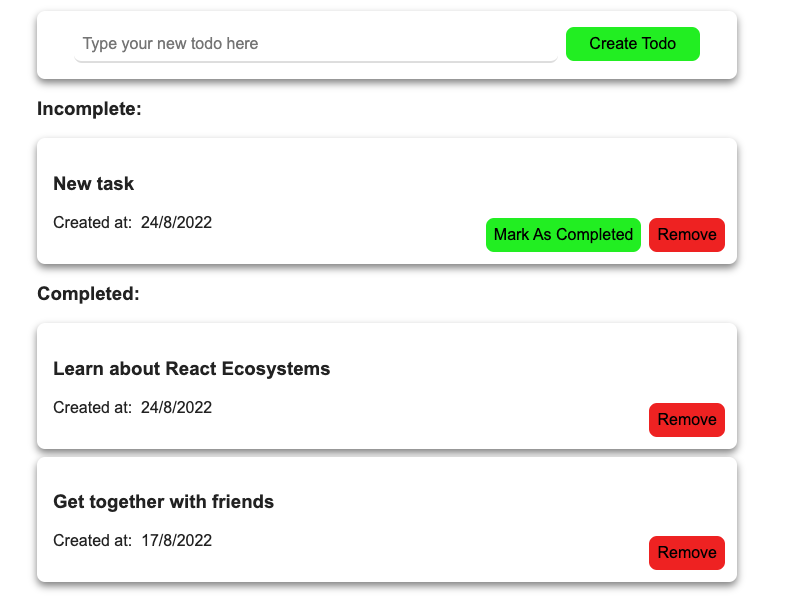

<!-- PROJECT TITLE -->
 

<h2 align="center">Building Modern Projects with React</h3>

 Linkedin course by Shaun Wassell

 

 

## About the project

I've followed this LinkedIn <a href="https://www.linkedin.com/learning/building-modern-projects-with-react/react-going-from-good-to-great?autoplay=true">course</a> offered by Shaun Wassell.
We've learned the most important tools in the React ecosystem that help simplify development and manage the complexities of state, side effects, structure, and styling. The project includes Redux, thunks, selectors, styled-components and tests.

I am on my way to achieve a fullstack overview, here's why -> :rocket: [go fullstack!](https://martaboteller.com/fullstack)

 

 

## Built with

Major frameworks/libraries used:

- Node.js (server)
- React (frontend)
- Babel
- Webpack
- Redux
- Mocha, Chai (testing)

 

## Author

I'm Marta Boteller, little more about me at my [website](https://martaboteller.com).

   

## Acknowledgments

This course is a bit outdated and thus I have been struggling at some points. I would like to thank <a href="https://www.linkedin.com/learning/building-modern-projects-with-react/react-going-from-good-to-great?autoplay=true">Shaun Wassell </a>Wassell anyway!

##
